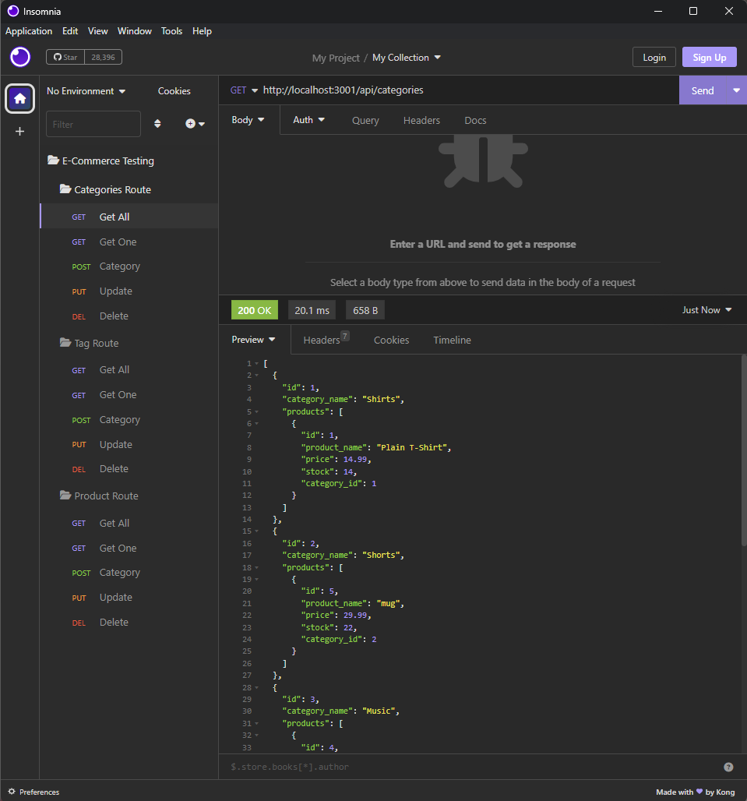

# e-commerce

## Technoogies Used
* Node.js  
* npm
* JavaScript
* MySQL
* MySQL2

## Description
The E-Commerce Backend allows users to see and update the database by using GET, POST, PUT, and DELETE requests in Insomnia Core.

## Visual

## Usage
* To source the schema.sql file run the following commands, "mysql -u root -p". Enter mysql password. To source the schema, "source schema.sql". To quit enter, "quit".  
* Install node modules by entering, "npm install".  
* To seed the data enter, "npm run seed".  
* To start the server enter, "npm start".  

## License
This application is licensed by MIT.  
License URL: https://opensource.org/licenses/MIT

## GitHub Repository
https://github.com/thoak90codes/e-commerce.git 

## Walkthrough Video Link
https://drive.google.com/file/d/11wmCGHh7TYQnT3AvruJgaAq-ah4dYSem/view 

## Author & Contributors
* https://github.com/thoak90codes  
* UW Coding Bootcamp  